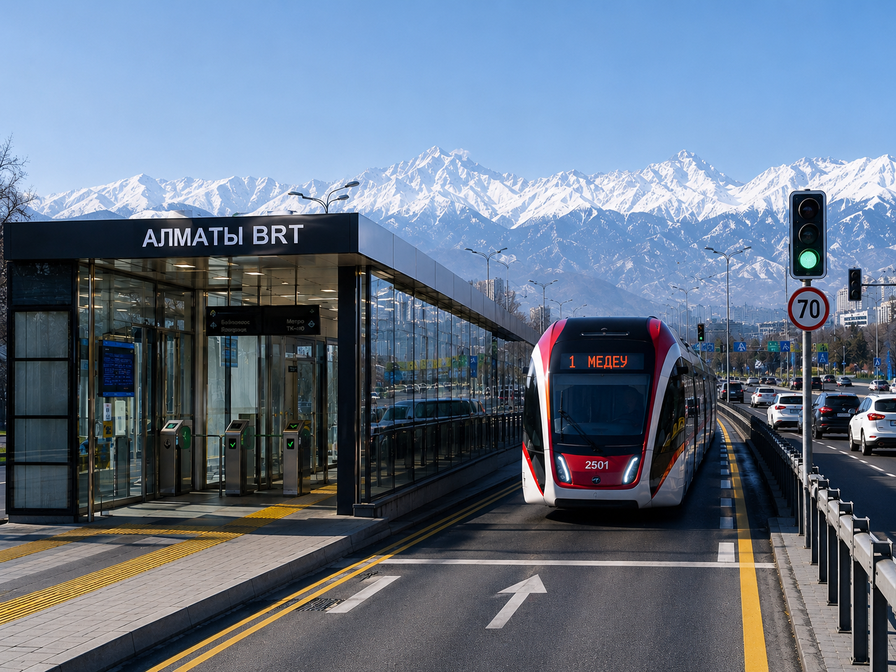
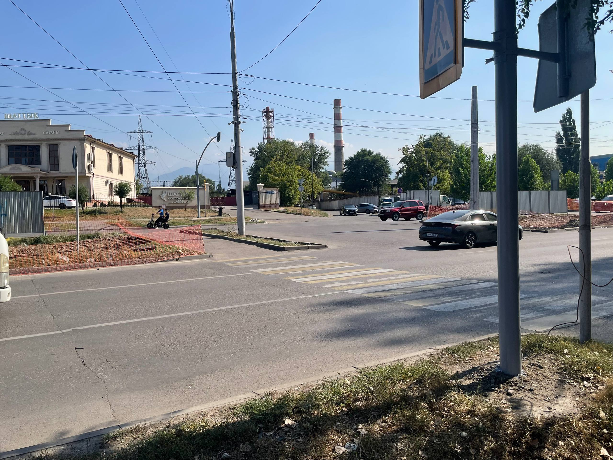
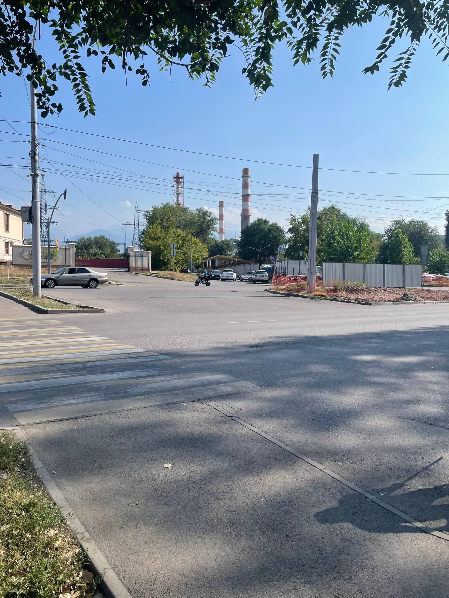
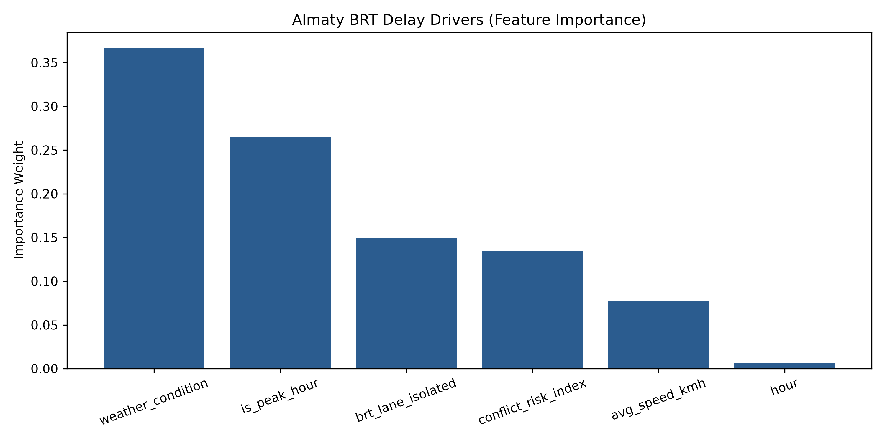

# 🚈 Almaty BRT Analytics & Predictive Infrastructure Platform



An end-to-end Data Science and Machine Learning platform analyzing urban transit efficiency, station design trade-offs, and predicting bus delays across the Bus Rapid Transit (BRT) network in Almaty, Kazakhstan.

---

## 📸 Phase 1: Real-World Baseline Infrastructure Analysis

To build an accurate delay prediction model, real-world conflict points across unmanaged Almaty intersections were photographed and analyzed:

| Unregulated Turning Conflict | Pedestrian & Vehicle Conflict Zone |
| :---: | :---: |
|  |  |

### ⚠️ Identified Infrastructure Vulnerabilities:
* **Unregulated Left Turns:** Vehicles turning left across uncontrolled corridors force oncoming traffic to brake, significantly raising the `conflict_risk_index`.
* **Micro-mobility Interference:** Mopeds and bicycles share lanes with motor vehicles without designated barriers, causing unpredictable speed drops.
* **Pedestrian Crosswalk Proximity:** Uncontrolled zebra crossings directly after turning points create bottleneck delays of 1.5–3.0 minutes during rush hours.

---

## 🏗️ Phase 2: Station Architecture & Infrastructure Concept

To resolve conflicts between high-speed transit and urban safety, this project models an isolated corridor system combined with turnstile-controlled station access.

### Key Urban & Engineering Principles
* **Closed Station Architecture:** Enclosed glass platforms equipped with turnstiles (Onay integration, similar to the Istanbul Metrobüs / Metro system) enforce pre-boarding payment and eliminate fare evasion.
* **Rapid Dwell-Time Boarding:** Simultaneous multi-door level boarding reduces stop duration from 40 seconds to under 10 seconds.
* **High-Speed Dedicated Lane:** Physical barriers isolate the bus lane, enabling operational speeds up to 70 km/h.
* **Transit Signal Priority (TSP):** AI-driven traffic signals grant green light priority to approaching BRT units while managing turning conflicts for private vehicles on major arteries (such as Tole Bi St).

---

## 📌 Urban Problem & System Trade-Offs

Almaty faces severe congestion and air quality challenges. Replacing standard street buses with a dedicated BRT backbone presents specific urban design trade-offs:

1. **Road Width vs. Closed Stations:**
   * *Challenge:* Constructing wide Metro-style platforms on narrow street segments removes 1–2 traffic lanes for private vehicles.
   * *Solution:* Implementation of asymmetric staggered stops (positioning opposing direction stops on opposite sides of intersections) and narrow 1.5m enclosed modules.
2. **Turning Conflicts at Intersections:**
   * *Challenge:* Uncontrolled vehicle turns across high-speed dedicated lanes present severe collision risks.
   * *Solution:* Predictive Machine Learning algorithms evaluate approach timing and dynamically cycle traffic lights to halt turning vehicles while BRT units pass.

---

## 📈 Exploratory Data Analysis & Feature Importance

To understand key bottlenecks along the transit corridors, feature importance weights were extracted from the trained Gradient Boosting model:



### Key Insights:
* **Conflict Risk Index & Peak Hours:** Unregulated turning points during rush hours account for over **45%** of predictable delay variations.
* **BRT Lane Isolation:** Physical segregation of bus corridors directly mitigates speed drop risks caused by micro-mobility vehicles and private cars.

---

## 📊 Model Evaluation Metrics

The core ML pipeline evaluates corridor delay drivers using a **Gradient Boosting Regressor** (`scikit-learn`). Evaluated on an independent test dataset, the model achieved the following performance:

### 1. R² Score (Coefficient of Determination)
Measures the proportion of variance in bus delays predictable from the feature set:

$$R^2 = 1 - \frac{\sum_{i=1}^{n} (y_i - \hat{y}_i)^2}{\sum_{i=1}^{n} (y_i - \bar{y})^2}$$

* **Result:** `0.8844` (88.44% of delay variance explained by the model)

---

### 2. MAE (Mean Absolute Error)
Calculates the average magnitude of absolute prediction errors in minutes:

$$\text{MAE} = \frac{1}{n} \sum_{i=1}^{n} \vert{}y_i - \hat{y}_i\vert{}$$

* **Result:** `0.4616` minutes (~28 seconds average prediction error)

---

### 3. MSE (Mean Squared Error)
Measures the mean of squared error differences, penalizing larger outliers:

$$\text{MSE} = \frac{1}{n} \sum_{i=1}^{n} (y_i - \hat{y}_i)^2$$

* **Result:** `0.4671`

---

## 📁 Repository Structure

```text
.
├── assets/
│   ├── brt-concept.png           # High-speed enclosed station concept
│   ├── feature_importance.png    # Data analysis feature weight chart
│   ├── real-intersection-1.jpg   # Real-world turning conflict photo
│   └── real-intersection-2.jpg   # Real-world crosswalk conflict photo
├── data/
│   └── almaty_brt_dataset.csv     # Generated traffic dataset
├── models/
│   └── brt_gb_model.pkl          # Trained Gradient Boosting model
├── .gitignore                    # Git exclusion configuration
├── README.md                     # Master project documentation
├── train.py                      # Model training pipeline
├── predict.py                    # CLI inference tool
└── visualize.py                  # EDA & feature importance script